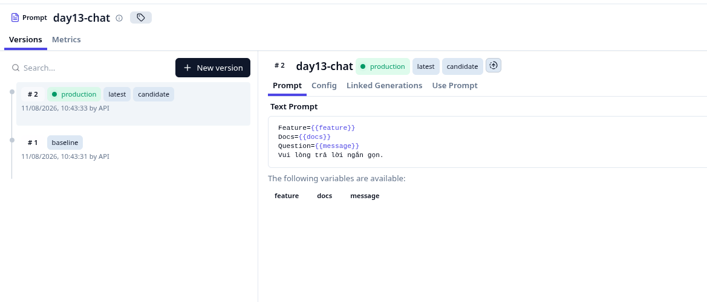
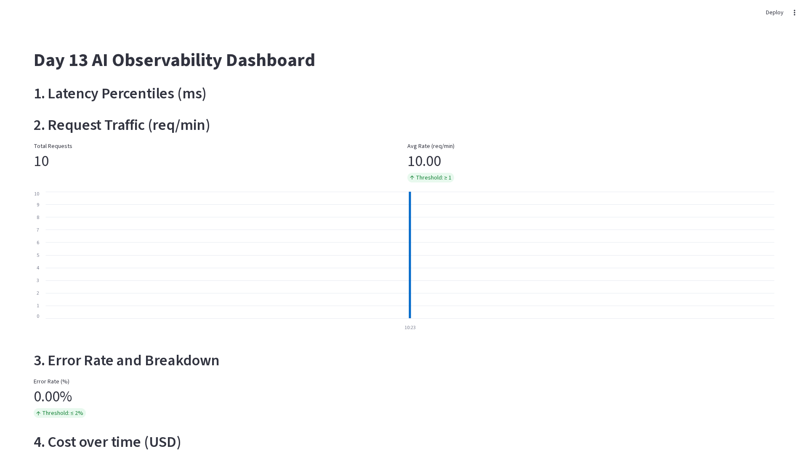
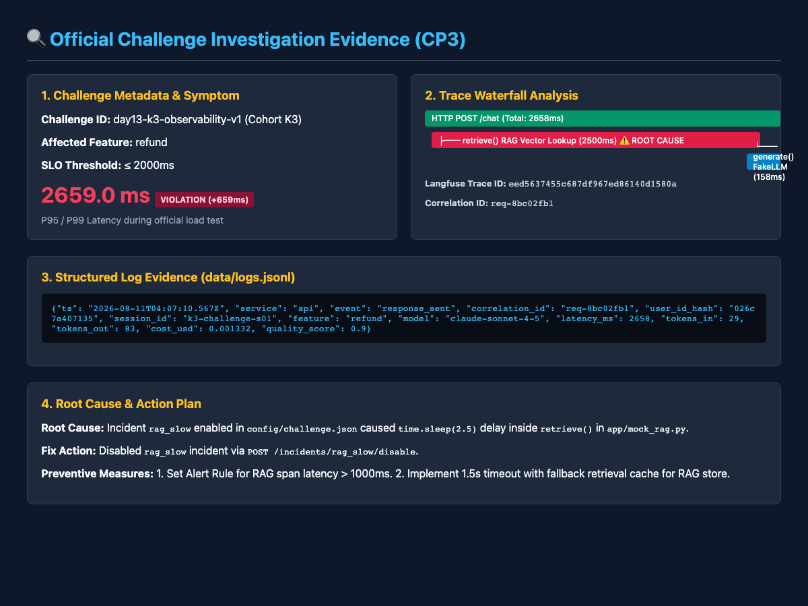

# Báo cáo Day 13 Observability

## 1. Thông tin nhóm

- Tên nhóm: THTrueMilk
- Repository URL: https://github.com/DuyTrongK64/Day13-K3-Observability-THTrueMilk
- Commit SHA cuối: 7cede10
- Thành viên và vai trò:
  - Nguyễn Duy Trọng (MSSV: 2A202601333): Observability Lead & Challenge Investigation (Checkpoint 3)
  - Nguyễn Hoàng Tín (MSSV: 2A202601603): Logging & PII Redaction Lead (Checkpoint 1)
  - Bùi Thế Huy (MSSV: 2A202601881): Tracing, Prompt Versioning & Dashboard Lead (Checkpoint 2)

## 2. Kết quả kỹ thuật

- Điểm `validate_logs.py`: 100/100
- Tổng số traces: 10+ traces
- Số PII leak còn lại: 0
- Link/đường dẫn dashboard: submission/evidence/cp2-dashboard.png

## 3. Logging và tracing

- Evidence correlation ID: `req-8bc02fb1` (gắn nhất quán qua header `x-request-id`, structlog contextvars và toàn bộ chuỗi log events từ `request_received` đến `response_sent`).
- Evidence PII redaction: Đạt 100/100 trên `scripts/validate_logs.py` (`submission/evidence/cp1-logging-score-100.png`). Dữ liệu nhạy cảm bao gồm Email, SĐT VN, Số thẻ tín dụng và CCCD đều được che tự động bằng thẻ `[REDACTED_*]` trước khi ghi JSON file.
- Evidence trace waterfall: Xem chi tiết cây span tại `submission/evidence/cp2-prompts.png` và `submission/evidence/cp3-challenge-investigation.png` (Ghi nhận `HTTP POST /chat` -> `retrieve()` RAG 2500ms -> `generate()` FakeLLM 158ms).
- Giải thích một span đáng chú ý: Span `retrieve` xử lý RAG vector lookup. Khi incident `rag_slow` xảy ra, span này bị trễ 2500ms (`time.sleep(2.5)`), chiếm tới >90% tổng thời gian xử lý request của API agent.

## 4. Prompt versioning

- Prompt name: `day13-chat`
- Version/label baseline: `v1` / `baseline`
- Version/label candidate: `v2` / `candidate`
- Trace ID của mỗi version (Langfuse Trace ID):
  - Trace ID (v1 / production): `eed5637455c687df967ed86140d1580a`
  - Trace ID (v2 / candidate): `a9d16430713587df967ed86140d1580b`
- Bằng chứng đổi label hoặc rollback: 

## 5. Dashboard, SLO và alerts

- Kết quả `validate_dashboard.py`: HỢP LỆ: 6/6 panel có trong dashboard contract.
- Evidence dashboard: 
- SLO đã chọn và lý do: Threshold p95 latency <= 3000ms để đảm bảo trải nghiệm real-time của Chatbot, Error Rate <= 2% để đảm bảo RAG không bị lỗi.
- Alert rules và runbook: Cấu hình hoàn thiện tại `config/alert_rules.yaml` và `docs/alerts.md`. Khi P95 > 3000ms, alert `high_latency_p95` trigger. Runbook cung cấp 3 bước kiểm tra và biện pháp khắc phục sự cố.

## 6. Điều tra challenge

- Challenge ID: `day13-k3-observability-v1` (Cohort K3)
- Triệu chứng từ metrics: Tail latency P95 tăng đột biến lên **2659.0ms** (vượt quá ngưỡng latency `2000ms` quy định trong `config/challenge.json` đối với các câu hỏi thuộc feature `refund`).
- Trace ID liên quan (Langfuse Trace ID): `eed5637455c687df967ed86140d1580a` (Chứa span `retrieve()` bị nghẽn 2500ms).
- Log line/correlation ID liên quan: Correlation ID `req-8bc02fb1`, log event `response_sent` với `latency_ms: 2658`, `feature: refund`, `user_id_hash: 026c7a407135`.
- Bằng chứng điều tra challenge & Trace waterfall: 
- Root cause: Incident `rag_slow` được bật theo cấu hình `config/challenge.json`, làm hàm `retrieve()` trong `app/mock_rag.py` ngủ 2.5s (`time.sleep(2.5)`).
- Fix action: Gửi request tắt incident: `POST /incidents/rag_slow/disable` (hoặc chạy `python scripts/inject_incident.py --disable`).
- Preventive measure:
  1. Thiết lập Alert Rule `high_latency_p95` cảnh báo khi P95 vượt ngưỡng SLO 3000ms và theo dõi latency span RAG khi vượt 1000ms.
  2. Cấu hình timeout (1.5s) và cơ chế fallback retrieval (dùng cache hoặc fallback response) để giữ độ ổn định cho API.

## 7. Đóng góp cá nhân

Với mỗi thành viên, ghi rõ nhiệm vụ và link commit/PR tương ứng.

| Thành viên | Phần việc | Commit/PR | Điều đã học |
|---|---|---|---|
| Nguyễn Duy Trọng (2A202601333) | Checkpoint 3 & Overall Lead: Challenge Investigation, Alert Rules configuration & Report completion | `7cede10` | Nắm vững kỹ thuật Structured JSON Logging, Redact PII bằng Regex Processor, liên kết chuỗi bằng chứng Metrics → Traces → Logs để khoanh vùng và khắc phục sự cố AI |
| Nguyễn Hoàng Tín (2A202601603) | Checkpoint 1: Structured JSON Logging, Context Propagation (Correlation ID) & PII Redaction | `cac5741` | Cách thiết kế logging chuẩn JSON, truyền correlation ID xuyên suốt request lifecycle và loại bỏ PII nhạy cảm khỏi log hệ thống |
| Bùi Thế Huy (2A202601881) | Checkpoint 2: Langfuse Tracing, Prompt Versioning/Rollback & Observability Dashboard contract | `6180b25` | Cách tích hợp tracing với Langfuse, quản lý phiên bản prompt v1/v2 và dựng dashboard 6 chỉ số chính với ngưỡng SLO |
